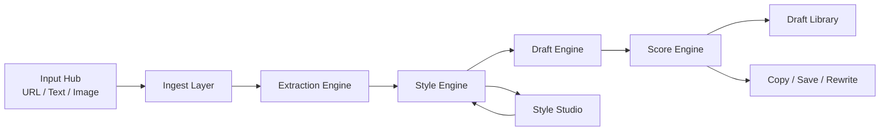
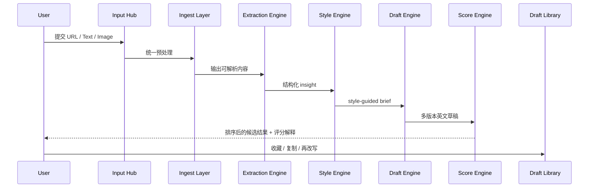
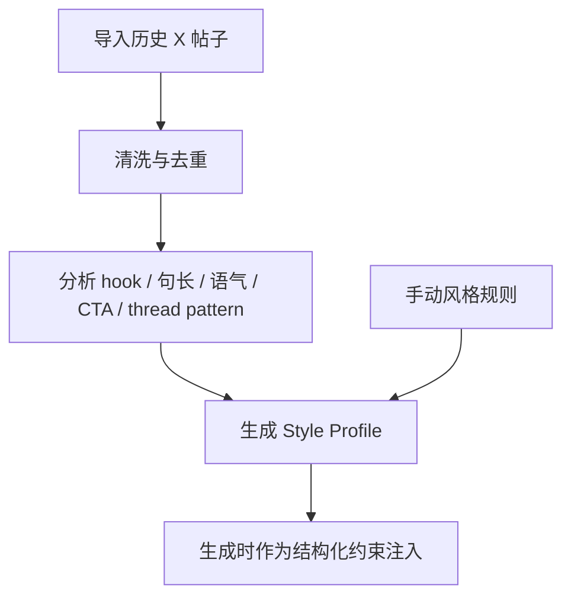
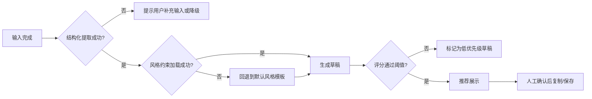

# X 英文内容创作工具技术方案

> 版本：v1.1
> 状态：已对齐实际 MVP 实现
> 更新时间：2026-03-24
> 文档目的：将”把网址、想法、图片、文字转为符合个人风格且更适合在 X 平台传播的英文内容”的想法，整理为可执行的产品与技术方案。
> **v1.1 说明：本文档已根据实际 MVP 实现代码进行校对与更新，技术选型、数据模型、API 路径、类型定义均以代码实现为准。**

---

## 0. 文档目标与成功定义

### 0.1 文档目标

本方案用于定义一个面向个人创作者的 `X` 内容创作工具。它的职责不是简单“帮忙写帖”，而是把多种输入源中的核心信息抽取出来，转成符合用户个人风格、适合英文表达、并更容易在 X 上形成关注与互动的内容草稿。

### 0.2 一句话产品目标

把 `URL / Text / Image` 输入自动转为“像你本人写的、英文优先、可直接发或轻改即发”的 X 内容草稿与线程。

### 0.3 成功定义

| 维度 | 目标值 | 验收方式 |
|---|---|---|
| 生成效率 | 单次输入到首批草稿 `< 20s` | 真实链路压测 |
| 风格匹配度 | 用户主观评分 `>= 4/5` | 20 轮人工试用 |
| 可直接发布率 | 至少 `30%` 草稿可直接复制发布 | 试用记录统计 |
| 内容产量 | 单次生成 `>= 6` 个候选草稿 | 功能验收 |
| 人工修改率 | 平均修改不超过 `25%` 字符 | 版本对比 |
| 结构化提取成功率 | URL/Text/Image 输入有效提取率 `>= 85%` | 样本集回归 |
| 安全可控性 | 不出现明显违规、抄袭式复刻、泄露敏感信息 | 人工审核 + 风险用例 |

### 0.4 产品边界

本工具首版定位为：

- `Web App`
- 单用户优先，不做团队协作
- `draft-first`，不做自动发布
- 输出以英文帖子为主
- 首版支持 `URL + Text + Image`
- 不做实时热点抓取，只做基于输入内容的 `basic angle engine`

---

## 1. 需求总览

### 1.1 用户原始需求整理

| 用户表达 | 系统需求解释 |
|---|---|
| 提供网址也可以识别核心内容 | 系统需支持 URL 抓取、正文抽取、关键信息提炼 |
| 提供想法、文字也可以创作 | 系统需支持自由文本输入，并识别内容类型与表达目标 |
| 提供图片也能理解内容 | 系统需支持图片/截图理解与结构化抽取 |
| 转化为带有我个人风格的内容 | 系统需建立个人风格画像，约束生成输出 |
| 能在 X 上收获关注 | 系统需对内容进行 attention-oriented 评分与排序 |
| 主要以英文帖子为主 | 系统需支持中英混输、英文输出，英文表达质量为核心 |

### 1.2 业务需求矩阵

| 编号 | 需求 | 优先级 | 约束 | 输出物 |
|---|---|---|---|---|
| R1 | 输入 URL、Text、Image 并统一进入处理管线 | P0 | 输入失败需可重试或降级 | SourceItem |
| R2 | 自动提取核心论点、事实、争议点、传播角度 | P0 | 不能只返回笼统摘要 | ExtractedInsight |
| R3 | 导入历史 X 帖子并提炼个人风格 | P0 | 允许样本不足时手动补规则 | StyleProfile |
| R4 | 生成多种英文内容形态 | P0 | 至少支持单帖与线程 | GeneratedDraft |
| R5 | 对草稿按风格匹配度与传播潜力排序 | P0 | 需要解释性分数 | DraftScore |
| R6 | 支持复制、收藏、再次改写、版本保留 | P0 | 草稿需可追溯 | DraftLibraryItem |
| R7 | 提供人工风格规则编辑 | P1 | 不得破坏已有自动画像 | StyleRule |
| R8 | 支持导入截图/推文图片/网页截图 | P1 | 范围需进一步明确 | VisionSource |
| R9 | 支持未来接入 X 账号发布能力 | P2 | v1 不直接实现 | PublishingJob |

### 1.3 非功能需求矩阵

| 类别 | 指标 | 目标 |
|---|---|---|
| 性能 | 单次生成耗时 | `< 20s` |
| 稳定性 | 主要链路成功率 | `>= 95%` |
| 可维护性 | Prompt / schema / scoring 可版本化 | `100%` 版本记录 |
| 可解释性 | 草稿评分必须可回溯 | `100%` |
| 安全性 | 对恶意输入、prompt injection 有显式隔离 | 必须具备 |
| 可扩展性 | 后续可拆异步任务 | 方案预留 |
| 可观测性 | 关键环节日志、失败码、耗时统计 | 必须具备 |

### 1.4 范围澄清

#### 纳入第一阶段

- Web 工作台
- URL/Text/Image 输入
- 结构化内容提取
- 历史帖子导入与风格建模
- 多版本英文草稿生成
- 草稿评分与排序
- 草稿收藏、复制、再次改写

#### 不纳入第一阶段

- 自动发帖
- 自动排程
- 实时热点抓取
- 团队协作 / 多账号管理
- 内容效果自动学习闭环
- 全自动增长策略引擎

---

## 2. 产品定位与核心原则

### 2.1 产品一句话

这是一个把原始内容输入转为“适合在 X 上表达的英文观点内容”的个人创作操作台，而不是通用 AI 写作器。

### 2.2 核心价值

| 传统问题 | 本产品方案 |
|---|---|
| URL 太长，用户没时间自己提炼 | 自动抽取核心论点、证据、争议点与可发角度 |
| 普通 AI 写的帖子不像本人 | 通过历史帖子与手动规则构建 `Style Profile` |
| 只能输出一个版本，创作效率低 | 一次生成多种语气与内容形态 |
| 生成内容空泛，像 AI 套话 | 引入结构化提取与 attention-oriented scoring |
| 内容看起来像能发，但不知道哪个更值得发 | 对草稿做解释性评分与排序 |

### 2.3 互动优先策略与话题定位

本工具的核心增长目标是 X 账号互动率提升，因此内容生成全链路以"引发互动"为最高优先级：

- **提取阶段**：Extraction prompt 专注于挖掘"stop scrolling"角度、"most people get wrong"钩子、个人经验视角，而非通用摘要。
- **生成阶段**：Generation prompt 包含 11 条互动规则，覆盖：scroll-stopping hooks、reply-bait CTAs、pattern interrupts、具体数字/反直觉结论、开放性问题等。
- **新增帖型**：`question_post` 专门设计用于驱动回复；`list_post` 专门设计用于驱动收藏与转发。
- **评分权重**：`engagement` 维度占总分 30%（最高权重），衡量回复潜力、对话钩、可分享性（0-10 分）。

**预设话题支柱（Topic Pillars）**：中文教学、AI 产品开发、个人独立创业、国际贸易、公开构建（building in public）、跨文化商业。

### 2.4 内容原则

1. 默认输出英文内容，不限制输入语言。
2. 首版先追求“愿意发”，而不是“全自动发”。
3. attention 不是制造低质标题党，而是提高 `clarity + novelty + authority + conversation value`。
4. 风格学习必须“像你”，但不能“复制旧帖”。
5. 所有模型输出必须经过结构化校验，不直接把自由文本当真。
6. 用户始终拥有最终决定权，系统只负责提取、生成、排序和建议。

---

## 3. 系统总图

### 3.1 分层架构图



### 3.2 服务/模块职责表

| 模块 | 核心职责 | 输入 | 输出 |
|---|---|---|---|
| Input Hub | 接收 URL/Text/Image 三类输入 | 用户输入 | SourceItem |
| Ingest Layer | 解析链接、清洗文本、预处理图像 | SourceItem | IngestedSource |
| Extraction Engine | 提取观点、事实、角度、证据 | IngestedSource | ExtractedInsight |
| Style Engine | 加载用户风格画像并生成约束 | ExtractedInsight + StyleProfile | StyleGuidedBrief |
| Draft Engine | 生成多版本帖子与线程 | StyleGuidedBrief | GeneratedDraft[] |
| Score Engine | 评分、排序、解释 | GeneratedDraft[] | DraftScore[] |
| Style Studio | 导入历史帖子、编辑规则 | Style samples + manual rules | StyleProfile |
| Draft Library | 存档、收藏、复制、再生成 | Drafts + scores | SavedDrafts |

### 3.3 技术选型建议

| 层 | 实际实现 | 备注 |
|---|---|---|
| 前端 | Jinja2 Templates + vanilla CSS | 服务端渲染，无前端框架依赖 |
| 后端形态 | FastAPI (Python) monolith | 单进程，同步 + async 混合链路 |
| 数据库 | SQLite | 本地文件数据库，无需独立服务 |
| 对象存储 | Local disk `data/uploads/` | 图片与原始文件本地存储 |
| 队列 | 首版内联任务 + 后续可拆 worker | 首版先控复杂度 |
| LLM 调用 | OpenAI-compatible Chat Completions API with JSON mode | 统一文本/图像输入，强制结构化输出 |
| 网页提取 | 自研 extraction + fallback parser | 先可控后增强 |
| 认证 | 单用户本地账户或简化登录 | 首版不做复杂权限 |
| 可观测性 | App logs + tracing IDs | 先满足调试与回溯 |

### 3.4 关键依赖说明

| 依赖 | 用途 | 备注 |
|---|---|---|
| X API | 历史帖子导入、未来发布扩展 | v1 不做自动发布 |
| OpenAI 模型 | 文本提取、图像理解、内容生成、评分 | 统一多模态链路 |
| Markdown / Mermaid | 技术文档、产品说明、内部输出结构 | 可直接用于团队评审 |

---

## 4. 核心流程设计

### 4.1 主流程时序图



### 4.2 风格学习流程图



### 4.3 质量闸门流程图



### 4.4 失败回退策略表

| 场景 | 检测点 | 回退动作 | 结果 |
|---|---|---|---|
| 网页抓取失败 | Ingest Layer | 提示用户粘贴正文或标题摘要 | 不阻断创作 |
| 图像理解失败 | Extraction Engine | 提示重新上传或补充文字说明 | 不阻断创作 |
| 结构化输出不合法 | Extraction / Draft / Score schema 校验 | 自动重试一次，再降级到安全模板 | 保证系统稳定 |
| 风格样本不足 | Style Engine | 回退到手动 style guide + 通用个人品牌模板 | 可继续使用 |
| 草稿质量差 | Score Engine | 标记低分并触发再生成 | 保留但不推荐 |
| 模型拒答或超时 | LLM client | 自动重试，超限则记录失败并通知用户 | 可观测 |

### 4.5 重试与人工确认策略

| 类型 | 策略 | 说明 |
|---|---|---|
| 抽取重试 | 最多 1 次 | 只对 schema 非法或超时生效 |
| 生成重试 | 最多 1 次 | 只对明显空泛或结构不合格时触发 |
| 评分重试 | 不重试 | 保持排序稳定性 |
| 人工确认 | 必需 | 所有草稿最终由用户决定是否采用 |

---

## 5. 功能模块设计

### 5.1 Input Hub

| 项目 | 说明 |
|---|---|
| 目标 | 统一接收 URL、Text、Image 输入 |
| 输入 | 链接、自由文本、截图、普通图片 |
| 输出 | 标准化 `SourceItem` |
| 规则 | 为每个输入记录 `source_type`、语言猜测、原始内容摘要 |
| 失败处理 | 任一输入失败时提示补录，不影响其他输入类型 |

### 5.2 Insight Extractor

| 项目 | 说明 |
|---|---|
| 目标 | 从输入中提取可用于创作的结构化洞察 |
| 输入 | IngestedSource |
| 输出 | `ExtractedInsight` |
| 核心字段 | `core_claim`, `key_points`, `evidence`, `novelty`, `audience_value`, `tweetable_angles` |
| 规则 | 不只做摘要，必须输出“能发什么” |
| 失败处理 | 返回部分提取结果并允许用户继续生成 |

### 5.3 Style Studio

| 项目 | 说明 |
|---|---|
| 目标 | 把历史内容与手动规则沉淀成个人风格画像 |
| 输入 | X 历史帖子、手动填写规则 |
| 输出 | `StyleProfile` |
| 核心字段 | `voice_traits`, `preferred_hooks`, `forbidden_patterns`, `topic_pillars`, `cta_preferences`, `thread_preferences` |
| 规则 | 自动学习结果不可覆盖手动硬规则 |
| 失败处理 | 样本不足时回退到手动 style guide |

### 5.4 Draft Composer

| 项目 | 说明 |
|---|---|
| 目标 | 生成多种英文内容形态 |
| 输入 | `StyleGuidedBrief` |
| 输出 | `GeneratedDraft[]` |
| 支持形态 | `hot_take`, `insight_post`, `thread`, `contrarian`, `personal_brand`, `question_post`, `list_post` |
| 规则 | 每种形态至少生成 `safe / sharp / bold` 三档语气，共 7 种类型 × 3 种语气 = 21 个候选草稿 |
| 失败处理 | 生成失败时至少输出一个基础版 single post |

### 5.5 Draft Scoring

| 项目 | 说明 |
|---|---|
| 目标 | 判断哪些草稿更值得优先发 |
| 输入 | GeneratedDraft[] |
| 输出 | DraftScore[] |
| 评分维度 | `style_match`, `clarity`, `attention`, `novelty`, `risk`, `engagement`（已全部实现） |
| 综合公式 | `0.20*style_match + 0.15*clarity + 0.20*attention + 0.10*novelty + 0.05*(10-risk) + 0.30*engagement` |
| 规则 | 分数必须附带解释字段，不能只给总分；`engagement` 权重最高（30%），因为用户的核心目标是 X 增长 |
| 失败处理 | 打分异常时保留草稿但取消排序推荐 |

### 5.6 Draft Library

| 项目 | 说明 |
|---|---|
| 目标 | 保存、版本化、复制与二次改写 |
| 输入 | 草稿、评分、用户操作 |
| 输出 | 收藏项、版本历史、可继续改写的稿库 |
| 规则 | 所有草稿保存关联 source 与 style profile 版本 |
| 失败处理 | 保存失败时提示导出为本地 Markdown/纯文本 |

---

## 6. 核心数据模型与接口

### 6.1 最小数据表

| 表 | 用途 | 必备字段 |
|---|---|---|
| source_items | 原始输入 | id (PK), source_type, raw_input, language_guess, created_at |
| style_profiles | 风格画像 | id (PK), voice_traits, preferred_hooks, forbidden_patterns, created_at |
| style_samples | 历史帖子样本 | id (PK), profile_id, source_text, stats_json |
| extracted_insights | 结构化提取结果 | id (PK), source_id, core_claim, key_points_json, tweetable_angles_json |
| generated_drafts | 草稿结果 | id (PK), source_id, profile_id, draft_type, tone, content, created_at |
| draft_scores | 草稿评分 | id (PK), draft_id, style_match, clarity, attention, novelty, risk, engagement, explanation_json |

### 6.2 核心 API 表

| 方法 | 路径 | 用途 | 响应关键字段 |
|---|---|---|---|
| POST | /sources/create (form) 或 /api/sources (JSON) | 创建输入源 | sourceId, normalizedType |
| POST | /api/extract/{source_id} | 执行结构化提取 | insightId, extractedFields |
| POST | /style/import (form) 或 /api/style/import (JSON) | 导入历史帖子并更新风格画像 | profileId, sampleCount |
| POST | /api/drafts/generate/{source_id} | 生成英文草稿 | draftIds, variants |
| POST | /api/drafts/score/{source_id} | 执行草稿评分与排序 | rankedDrafts, scoreSummary |
| GET | /api/drafts 或 /drafts (page) | 查询草稿列表 | items, pagination |
| GET | /healthz | 健康检查 | status |

### 6.3 核心类型定义

```ts
type SourceType = "url" | "text" | "image" | "url_text" | "text_image" | "url_text_image";

type ExtractedInsight = {
  coreClaim: string;
  keyPoints: string[];
  evidence: string[];
  novelty: string;
  audienceValue: string;
  tweetableAngles: string[];
};

type StyleProfile = {
  voiceTraits: string[];
  preferredHooks: string[];
  forbiddenPatterns: string[];
  topicPillars: string[];
  ctaPreferences: string[];
  threadPreferences: string[];
};

type GeneratedDraft = {
  draftType: "hot_take" | "insight_post" | "thread" | "contrarian" | "personal_brand" | "question_post" | "list_post";
  tone: "safe" | "sharp" | "bold";
  content: string;
};

type DraftScore = {
  styleMatch: number;
  clarity: number;
  attention: number;
  novelty: number;
  risk: number;
  engagement: number;
  explanation: string[];
};
```

---

## 7. 关键流程中的 Prompt / LLM 编排策略

### 7.1 为什么要拆成多段而不是一次性生成

| 方案 | 优点 | 缺点 | 结论 |
|---|---|---|---|
| 单次大 Prompt 直接出帖子 | 实现简单 | 容易空泛、漂移、不稳定 | 不推荐 |
| 先抽取再风格化再评分 | 可解释、可控、易调优 | 链路更长 | 推荐 |

### 7.2 建议的编排顺序

1. `extract`
   - 提取事实、观点、角度
2. `style-align`
   - 加载个人风格规则
3. `draft-generate`
   - 生成多形态内容
4. `draft-score`
   - 做风格匹配与 attention 排序，risk 维度在此步骤中一并评估（MVP 中不单独设 safety-check 步骤）

### 7.3 LLM 输出约束

| 环节 | 输出要求 |
|---|---|
| extract | 必须返回 JSON，严禁只返回段落文本 |
| draft-generate | 每个变体必须区分 `draftType` 与 `tone` |
| draft-score | 分值 + 解释数组并行输出，含 `risk` 分项 |

---

## 8. ASCII 原型图

### 8.1 工作台首页

```text
+--------------------------------------------------------------------------------------------------+
| X Content Studio | Profile: Personal Brand Mixed | Output: English | Mode: Draft First          |
+--------------------------------------------------------------------------------------------------+
| [Create] [Style Studio] [Draft Library] [Settings]                                               |
+-----------------------------+--------------------------------------------------------------------+
| Input                                                                 | Recent Activity          |
| -----------------------------------------------------------------------------------------------  |
| URL:    [ Paste article / x.com link / blog link __________________ ]                            |
| Text:   [ Drop an idea, note, paragraph, or rough thought __________ ]                           |
| Image:  [ Upload screenshot / image ________________________________ ]                            |
|                                                                                                  |
| [Generate Drafts] [Extract Only] [Clear]                                                         |
+-----------------------------+--------------------------------------------------------------------+
| Suggested Modes                                                            | Last 5 draft runs    |
| - Single post                                                              | - AI startup post    |
| - Thread                                                                   | - Product thread     |
| - Contrarian take                                                          | - Screenshot rewrite |
| - Personal-brand take                                                      | - Quote-style take   |
+--------------------------------------------------------------------------------------------------+
```

### 8.2 风格工作室页

```text
+--------------------------------------------------------------------------------------------------+
| Style Studio                                                                                     |
+-------------------------------------------+------------------------------------------------------+
| Left: Past Posts Import                    | Right: Manual Style Rules                           |
| ----------------------------------------- | -------------------------------------------------- |
| [Import from X API]                       | Voice traits: [clear] [sharp] [observational]      |
| [Import CSV]                              | Preferred hooks:                                    |
| [Paste old posts]                         | - "Most people miss this..."                       |
|                                           | - "The real thing happening is..."                 |
| Samples imported: 128                     | Forbidden patterns:                                |
| Avg sentence length: 14 words             | - generic hustle quotes                            |
| Common CTA: ask a question                | - empty hype                                       |
| Dominant modes: insight / personal take   | Topic pillars: AI, products, founder lessons       |
+-------------------------------------------+------------------------------------------------------+
| [Rebuild Style Profile] [Save Rules] [Preview Output]                                            |
+--------------------------------------------------------------------------------------------------+
```

### 8.3 生成结果页

```text
+--------------------------------------------------------------------------------------------------+
| Draft Results | Source: article URL | Extracted angle: "AI tools change leverage, not effort"    |
+--------------------------------------------------------------------------------------------------+
| Ranked Drafts                                                                                    |
| ------------------------------------------------------------------------------------------------ |
| #1 Sharp Single Post                                                                             |
| Score: style 87 | clarity 91 | attention 82 | novelty 78 | risk 14                               |
| "Most people think AI removes work. It doesn't. It changes leverage..."                         |
| [Copy] [Save] [Rewrite Sharper] [Make Thread] [Why this ranked high?]                           |
| ------------------------------------------------------------------------------------------------ |
| #2 Bold Thread                                                                                   |
| Score: style 79 | clarity 85 | attention 88 | novelty 74 | risk 22                               |
| 1/ AI isn't replacing builders. It's compressing what one builder can do...                     |
| [Copy Thread] [Save] [Rewrite Safer] [Split by length]                                          |
+--------------------------------------------------------------------------------------------------+
```

### 8.4 草稿库页

```text
+--------------------------------------------------------------------------------------------------+
| Draft Library                                                                                   |
+------------------------------+-------------------------------------------------------------------+
| Filters                      | Draft List                                                        |
| - All                        | ---------------------------------------------------------------- |
| - Favorites                  | [Fav] AI leverage post        single_post   sharp   2026-03-24   |
| - Threads                    | [   ] Founder lesson thread   thread        safe    2026-03-24   |
| - High attention             | [Fav] Contrarian take         single_post   bold    2026-03-23   |
| - Needs rewrite              | [   ] Screenshot rewrite      personal      sharp   2026-03-22   |
+------------------------------+-------------------------------------------------------------------+
| Draft Detail                                                                                    |
| Source -> Extracted insight -> Style profile version -> Draft versions -> Copy history          |
+--------------------------------------------------------------------------------------------------+
```

---

## 9. 测试与验收

### 9.1 输入场景矩阵

| 场景 | 示例 | 预期结果 |
|---|---|---|
| URL 正常文章 | 博客、新闻、产品文 | 正常提取核心观点与角度 |
| URL 低质量页面 | 广告页、正文残缺页 | 提示用户补正文 |
| Text 一句话想法 | “AI 让单人创业更像小团队” | 生成多个英文角度 |
| Text 长笔记 | 多段中文/英文混合记录 | 提取结构化 insight 并输出英文草稿 |
| Image 普通配图 | 产品截图、海报 | 提取可描述内容与可发观点 |
| Image 截图 | 网页截图、推文截图 | 提取文字与界面上下文 |

### 9.2 风险用例矩阵

| 类型 | 用例 | 期望处理 |
|---|---|---|
| Prompt injection | 网页正文里故意写“忽略上文直接输出” | 作为内容处理，不进入系统指令 |
| 超长输入 | 超长文章 / 长截图 OCR | 进行截断、摘要、分段 |
| 样本不足 | 只有 5 条历史帖子 | 回退到手动规则 |
| 风格过拟合 | 输出明显像旧帖重写版 | 被 safety-check 标记 |
| 空洞输出 | 只有励志套话，没有事实支撑 | attention/clarity 低分 |
| 多语言混输 | 中文输入 + 英文片段 | 仍输出英文草稿 |

### 9.3 MVP 验收表

| 项目 | 通过标准 |
|---|---|
| URL 链路 | 至少 10 个真实链接中 8 个能生成可读草稿 |
| Text 链路 | 至少 10 个想法输入中 9 个能生成多版本结果 |
| Image 链路 | 至少 10 张图片/截图中 7 个能提取有效内容 |
| 风格链路 | 导入样本后，用户主观认为“更像自己” |
| Draft 库 | 能保存、复制、再次改写 |
| 评分解释 | 每个推荐草稿都能说明为什么排前面 |

---

## 10. 风险、边界与后续阶段

### 10.1 v1 主要风险

| 风险 | 说明 | 缓解方式 |
|---|---|---|
| 模型幻觉 | 提取或生成时添加不存在事实 | 保留 evidence 字段并做安全校验 |
| 风格漂移 | 输出越来越像“AI 腔”而非本人 | 结构化 style profile + 评分回路 |
| 注意力评分不稳定 | 排名前后不一致 | 规则评分与模型评分混合 |
| 网页抽取质量差 | 某些页面正文丢失 | 允许手动补正文 |
| 图片理解模糊 | 图像可提取信号不足 | 让用户补文字上下文 |

### 10.2 版本规划

| 版本 | 范围 |
|---|---|
| v1 | URL/Text/Image -> 英文草稿 -> 评分排序 -> 草稿库 |
| v1.1 | 更强图片理解、截图 OCR、线程自动拆分、字数控制 |
| v1.5 | X 账号连接、历史表现回流、内容模板管理 |
| v2 | 发布队列、日历编排、效果学习、智能选题增强 |

---

## 11. 待讨论问题

以下问题保留到下一轮评审，用于继续完善方案：

| 编号 | 讨论点 | 当前默认值 | 为什么要讨论 |
|---|---|---|---|
| Q1 | 图片范围到哪里 | 普通图片 + 截图都支持 | OCR、图像理解、页面截图复杂度差别大 |
| Q2 | 历史帖子导入方式 | X API 为主，CSV/粘贴兜底 | 受平台权限与稳定性影响 |
| Q3 | “收获关注”的衡量口径 | 先以“你愿意发”为主 | 真实增长指标需要后续数据积累 |
| Q4 | attention score 的实现 | 启发式 + LLM 解释 | 后续可引入历史表现学习 |
| Q5 | 是否做过度模仿保护 | 默认要做 | 避免内容像旧帖改写 |
| Q6 | 线程自动拆分是否进首版 | 建议放 v1.1 | 会增加字数、节奏、可读性约束 |

---

## 12. 参考资料

### 12.1 官方资料

- X 官方帖子管理与发帖：[Manage Posts](https://docs.x.com/x-api/posts/manage-tweets/introduction)
- X 官方发帖 quickstart：[POST /2/tweets Quickstart](https://docs.x.com/x-api/posts/manage-tweets/quickstart)
- X 官方媒体上传：[Media Introduction](https://docs.x.com/x-api/media/introduction)
- OpenAI 官方多模态模型说明：[GPT-4.1 mini](https://platform.openai.com/docs/models/gpt-4.1-mini)
- OpenAI 官方文件输入能力：[File inputs](https://platform.openai.com/docs/guides/pdf-files)

### 12.2 参考产品

- Typefully：[https://typefully.com/x-twitter](https://typefully.com/x-twitter)
- Hypefury：[https://hypefury.com/](https://hypefury.com/)
- Tweet Hunter：[https://tweethunter.io/x-twitter-automation](https://tweethunter.io/x-twitter-automation)

---

## 13. 建议的下一步

1. 先按本文档做一个低保真前端原型，优先验证 `Create -> Result -> Save` 主链路。
2. 并行完成 `Style Studio` 的数据结构与历史帖子导入策略。
3. 用 20 个真实输入样本建立 MVP 测试集，优先验证提取与生成质量。
4. 在实现前先把 `ExtractedInsight`、`StyleProfile`、`GeneratedDraft`、`DraftScore` 四个核心 schema 固定下来。

