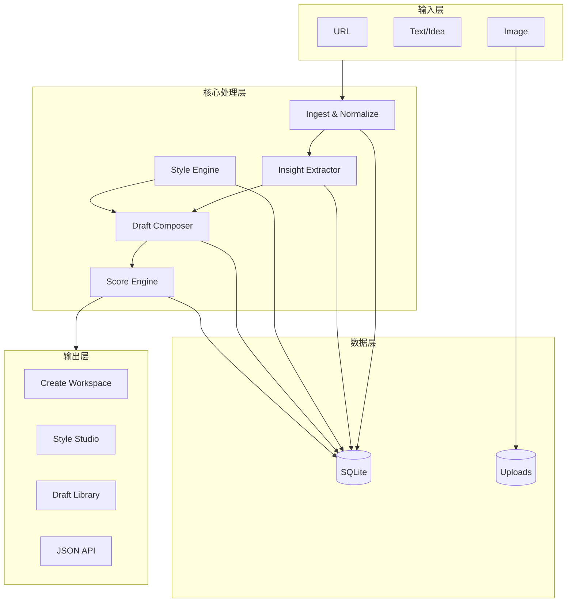
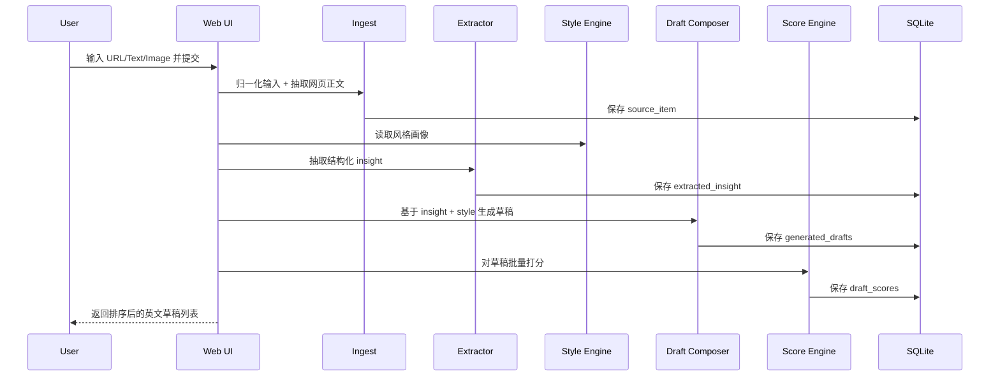
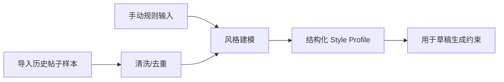
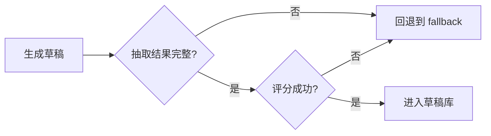

# X 内容创作工具 MVP 技术方案

## 0. 文档目标与成功定义

### 0.1 文档目标
将“URL/想法/图片/文字 -> 提取核心内容 -> 生成个人风格英文 X 帖子”的构想落地为可直接开发与试运行的 MVP 技术方案。

### 0.2 成功定义
| 维度 | 目标值 | 验收方式 |
|---|---|---|
| 生成效率 | 单次生成 21 条候选草稿 | 输入一次后输出覆盖 7 种帖子类型 × 3 种语气 |
| 内容速度 | 正常输入下 30~120 秒产出 | 从提交到可见草稿的端到端耗时统计 |
| 风格一致性 | 风格匹配分可稳定区分好坏 | `style_match` 可排序，Top 草稿更像历史样本 |
| 可用性 | 无 API key 也可运行 | Fallback 逻辑可完成抽取、生成与评分 |
| 可运营性 | 草稿可管理可复用 | 有 Draft Library，可检索历史内容 |

## 1. 需求总览（整理后的产品需求）

### 1.1 业务需求矩阵
| 编号 | 需求 | 优先级 | 说明 | 输出 |
|---|---|---|---|---|
| R1 | 支持 URL 输入 | P0 | 自动抓取网页正文并提炼观点 | Source + Insight |
| R2 | 支持文字输入 | P0 | 用户可粘贴想法/笔记/草稿 | Source + Insight |
| R3 | 支持图片输入 | P0 | 图片可参与内容理解与生成 | Source + Insight |
| R4 | 提取结构化关键信息 | P0 | core claim、evidence、angles | ExtractedInsight |
| R5 | 个人风格建模 | P0 | 历史帖子 + 手动规则 | StyleProfile |
| R6 | 生成多类型英文帖子 | P0 | 7 种类型：`hot_take`, `insight_post`, `thread`, `contrarian`, `personal_brand`, `question_post`, `list_post` | GeneratedDrafts |
| R7 | 自动质量评分与排序 | P0 | style/clarity/attention/novelty/risk/engagement（engagement 权重最高 30%） | DraftScores |
| R8 | 草稿库沉淀 | P0 | 检索、回看、复制复用 | DraftLibrary |
| R9 | API 可编排调用 | P1 | 方便未来与其他系统集成 | JSON API |

### 1.2 非功能需求矩阵
| 类别 | 指标 | 目标 |
|---|---|---|
| 可维护性 | 单体架构清晰 | 模块边界明确，后续可拆 worker |
| 可恢复性 | AI 异常可降级 | 不因 API 异常导致流程不可用 |
| 安全性 | 不强制存储密钥 | API key 本地 `.env` 配置 |
| 可追溯性 | 每次生成可回溯 | source/insight/draft/score 全链路落库 |
| 扩展性 | 支持后续接 X API | 数据模型预留发布阶段字段 |

### 1.3 范围澄清
| 维度 | MVP 纳入 | MVP 不纳入 |
|---|---|---|
| 发布 | Draft-first，人工复制发布 | 一键发帖、自动排程 |
| 热点 | Basic angle engine | 实时抓全网热点并自动追踪 |
| 用户 | 单人使用 | 团队协作、多租户权限 |
| 输入 | URL + Text + Image | 视频/音频输入 |

## 2. 总体架构与选型

### 2.1 分层架构图


### 2.2 技术选型表
| 层 | 选型 | 说明 |
|---|---|---|
| 应用框架 | FastAPI + Jinja2 | 单体 Web App，开发效率高 |
| 数据库 | SQLite | MVP 阶段最小可用，零运维 |
| AI 调用 | OpenAI 兼容 HTTP API | 本地 `.env` 配置 API key |
| 网页解析 | requests + BeautifulSoup | URL 正文抽取 |
| 前端样式 | 原生 HTML + CSS | 降低复杂度，保留可读 UI |
| 文件存储 | 本地 `data/uploads/` | 图片输入与可视化预览 |

### 2.3 服务职责拆分（代码模块）
| 模块 | 核心职责 |
|---|---|
| `app/db.py` | SQLite 初始化、数据读写、关系落库 |
| `services/ingest.py` | URL 抽取、文本归一化、图片编码 |
| `services/style_engine.py` | 风格样本提炼、风格 Profile 生成 |
| `services/content_pipeline.py` | 抽取、生成、评分主链路 |
| `services/ai_client.py` | AI JSON 接口调用与错误处理 |
| `app/main.py` | 页面路由 + API 路由 + 流水线编排 |

## 3. 核心流程设计

### 3.1 主生成流程时序图


### 3.2 风格建模流程


### 3.3 发布闸门（MVP 版）


### 3.4 失败回退策略
| 场景 | 检测点 | 回退动作 |
|---|---|---|
| URL 抓取失败 | HTTP 非 2xx/解析失败 | 用户仍可用 text/image 继续生成 |
| AI 提取失败 | JSON 解析失败/超时 | 触发本地 heuristic insight |
| AI 生成失败 | 返回空或格式错误 | 触发本地模板生成 21 条草稿 |
| AI 评分失败 | 返回结构不完整 | 触发本地评分启发式 |
| 无 API key | 启动时未配置 key | 全链路 fallback，可继续使用 |

## 4. 数据模型与接口

### 4.1 最小数据模型
| 表名 | 关键字段 | 用途 |
|---|---|---|
| `style_profiles` | `voice_traits` `preferred_hooks` `forbidden_patterns` | 风格主配置 |
| `style_samples` | `post_text` | 历史帖子样本 |
| `source_items` | `source_type` `url` `raw_input` `image_path` | 原始输入 |
| `extracted_insights` | `core_claim` `key_points` `tweetable_angles` | 结构化洞察 |
| `generated_drafts` | `post_type` `tone` `content` | 候选帖子 |
| `draft_scores` | `style_match` `clarity` `attention` `novelty` `risk` `engagement` `overall` | 评分与排序 |

### 4.2 核心 API
| 方法 | 路径 | 说明 |
|---|---|---|
| POST | `/api/sources` | 创建 source 并执行完整流水线 |
| POST | `/api/extract/{source_id}` | 仅重跑抽取 |
| POST | `/api/style/import` | 导入样本并重建风格 |
| POST | `/api/drafts/generate/{source_id}` | 对指定 source 重新生成 |
| POST | `/api/drafts/score/{source_id}` | 对指定 source 重评分 |
| GET | `/api/drafts` | 获取草稿库列表 |
| GET | `/healthz` | 健康检查 |

## 5. 页面与交互原型（ASCII）

### 5.1 Create 工作台
```text
+----------------------------------------------------------------------------------+
| X Content Creation MVP                                                           |
| [Create] [Style Studio] [Draft Library]                                          |
+----------------------------------------------------------------------------------+
| Input                                                                            |
| URL:  [_____________________________________________]                            |
| Text: [paste notes/idea/article snippet ...                  ]                   |
| Image:[Choose File]                                                              |
| [Generate Drafts]                                                                |
+----------------------------------------------------------------------------------+
| Recent Drafts                                                                    |
| #123 insight_post sharp score:8.7  "Hard truth: ..."                             |
| #122 thread bold score:8.4        "1/... 2/... 3/..."                            |
+----------------------------------------------------------------------------------+
```

### 5.2 Style Studio
```text
+----------------------------------------------------------------------------------+
| Style Studio                                                                     |
+--------------------------------------+-------------------------------------------+
| Import Samples                        | Rebuild Profile                           |
| [textarea one post per line]          | [manual style guide textarea]            |
| [file upload .txt/.csv]               | [Rebuild]                                 |
| [Import]                              |                                           |
+--------------------------------------+-------------------------------------------+
| Current Profile: voice traits / hooks / forbidden patterns / topic pillars       |
+----------------------------------------------------------------------------------+
```

### 5.3 Source Detail + Draft Ranking
```text
+----------------------------------------------------------------------------------+
| Source #45 | type: url_text_image                                                |
| Core Claim: ...                                                                   |
| Angles: ... | ... | ...                                                          |
+----------------------------------------------------------------------------------+
| Drafts (Ranked)                                                                   |
| [insight_post][sharp] score 8.9   [Copy]                                          |
| "Hard truth: ... Most people ..."                                                 |
| style 8.8 | clarity 8.7 | attention 9.2 | novelty 7.6 | engagement 9.4            |
| rationale: strong hook + concrete implication + reply-bait CTA                   |
+----------------------------------------------------------------------------------+
```

## 6. 安全与质量控制
| 维度 | 策略 |
|---|---|
| Prompt 注入 | 抽取前归一化，提示词明确“仅基于内容事实” |
| 错误控制 | AI 调用异常统一捕获，保证 fallback 可用 |
| 数据安全 | API key 不入库，本地 `.env` 保存 |
| 可解释性 | 每条草稿保留评分与 rationale |
| 可追溯性 | source -> insight -> drafts -> scores 全链路可查 |

## 7. 测试计划（MVP）
| 测试类目 | 用例 |
|---|---|
| 输入链路 | URL-only / text-only / image-only / 混合输入 |
| 抽取质量 | 长文、短文、噪声文、标题党内容 |
| 生成质量 | 7 类型 × 3 语气组合是否齐全（含 question_post 驱动回复、list_post 驱动收藏/转发） |
| 排序质量 | 高分草稿是否更可发布；engagement 维度是否正确反映回复/收藏潜力 |
| 失败回退 | 断网/API key 缺失/返回异常 JSON |
| UI 可用性 | 桌面和移动视口是否可操作 |

## 8. 实施阶段建议
| 阶段 | 目标 | 状态 |
|---|---|---|
| Phase 1 | 架构搭建 + 数据模型 | 已实现 |
| Phase 2 | 抽取/风格/生成/评分流水线 | 已实现 |
| Phase 3 | UI 页面 + 草稿库 + API | 已实现 |
| Phase 4 | Bug 修复 + 代码 Review 优化 | 已实现 |
| Phase 5 | 真实数据验证与打磨 | 进行中 |

## 9. 需继续讨论的问题（下一轮完善）
| 编号 | 问题 | 当前默认 |
|---|---|---|
| Q1 | 是否接入 X 官方 API 自动发布 | 暂不接入，保持 draft-first |
| Q2 | attention score 是否引入历史表现学习 | MVP 使用规则+AI评分 |
| Q3 | 是否加入“内容日历/排程” | MVP 不做 |
| Q4 | 是否支持多人协作与品牌账号 | MVP 不做 |
| Q5 | 图片链路是否增加 OCR 文本层 | MVP 交给多模态模型处理 |

## 10. 本方案对应实现清单（代码映射）
| 方案模块 | 实现文件 |
|---|---|
| 单体 Web 架构 | `app/main.py` |
| 数据模型与持久化 | `app/db.py` |
| URL/Text/Image 摄取 | `app/services/ingest.py` |
| 风格建模 | `app/services/style_engine.py` |
| 抽取/生成/评分 | `app/services/content_pipeline.py` |
| AI 接口适配 | `app/services/ai_client.py` |
| Create/Style/Draft UI | `app/templates/*.html` + `app/static/styles.css` |
